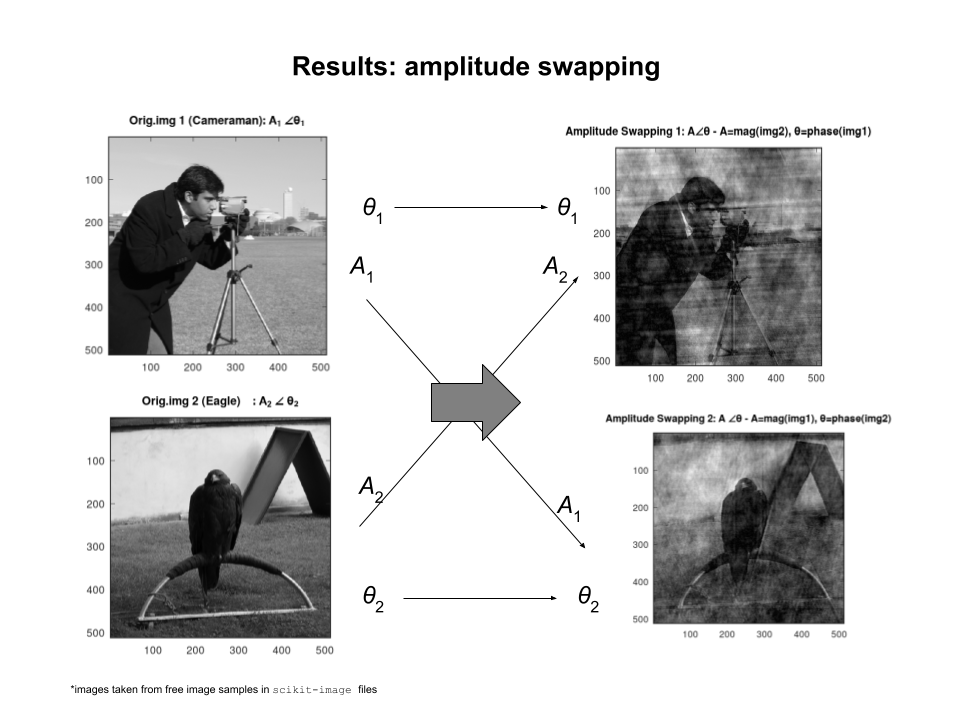
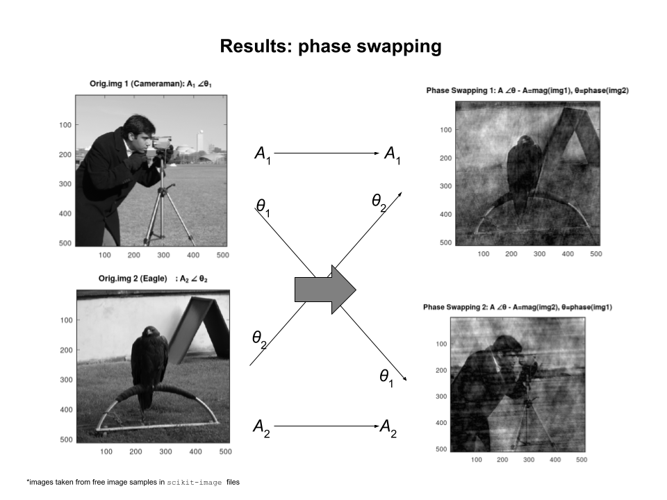
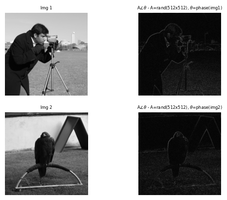

### The Importance of Phase in Image

A simple test to see whether the amplitude or the phase of an image that carries information (features) of an image. 

The test is based on a seminal work from A.V.Oppenheim \& J.S.Lim,"The Importance of Phase in Signals", Proceedings of IEEE, Vol.69, Iss.5, May 1981. A 'classic' paper - which according to Google Scholar its citation is >2,600 times! (data per January 2026)

Following a Fourier Transform, an image will be decomposed into its *Amplitude* (or sometimes also called as Magnitude) and *Phase* components (see Fig.1) . If we have two images, by swapping the amplitude of one image into another whilst keeping the phase intact (and vice versa) we can see which component that contains the image information. Note that in Fig.1  $A$ and __$\theta$__ are the amplitude and phase of each image, respectively, and therefore $A_1$ and $\theta_1$ are the amplitude and phase of image 1 and $A_2$ and $\theta_2$ for the amplitude and phase of image 2.

   
  <em>Figure 1: FFT decomposition of an image into its Amplitude & Phase components</em>

 

Now if we have two images and swap their amplitudes, whilst keeping the phases intact, the result after Inverse Fourier Transform is shown in Fig.2 (left). If we do the opposite i.e. swap their phases and keeping the amplitude unchanged, the outcomes of the process is shown in Fig.2 (right).

    
   
  <em>Figure 2: Results of amplitude (left), and phase swapping (right)</em>

 

The test results indicate that it is the phase that carries the information of an image. One can therefore set arbitrary random values to the amplitude, but keep the phase unchanged, and the features of the image will be preserved as shown in Fig.3

   
  <em>Figure 3: Setting the amplitude to random values whilst keeping the phase information preserve image features</em>
</div

